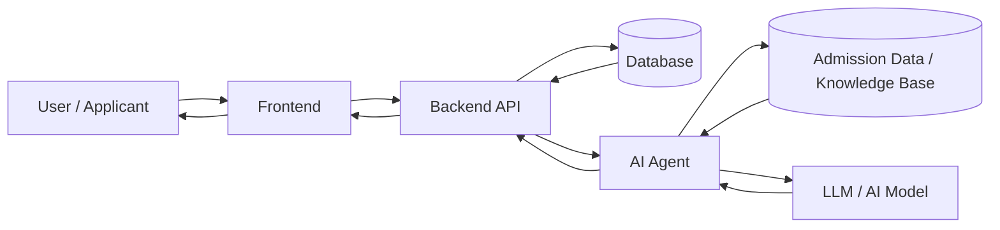

# University admission system

Course Project **Software Engineering**

A system supporting candidates with admission registration and administrators with application review, featuring an integrated AI virtual assistant for automated consultation.

## Installation

to be added

## Usage Guidelines

to be added

## Contributing

to be added

## System Pipeline



#test

```md
## AI Agent Pipeline

```mermaid
flowchart TD
    Q[User Question]
    BE[Backend Request]
    PRE[Preprocess Input]
    INTENT[Intent Detection]
    RETRIEVE[Retrieve Admission Info]
    CONTEXT[Build Context]
    LLM[LLM / AI Model]
    VALIDATE[Validate Response]
    RES[Return Answer]

    Q --> BE
    BE --> PRE
    PRE --> INTENT
    INTENT --> RETRIEVE
    RETRIEVE --> CONTEXT
    CONTEXT --> LLM
    LLM --> VALIDATE
    VALIDATE --> RES
    RES --> BE


