# University admission system

Course Project **Software Engineering**

A system supporting candidates with admission registration and administrators with application review, featuring an integrated AI virtual assistant for automated consultation.

## Installation

to be added

## Usage Guidelines

to be added

## Contributing

to be added

## System Architecture

  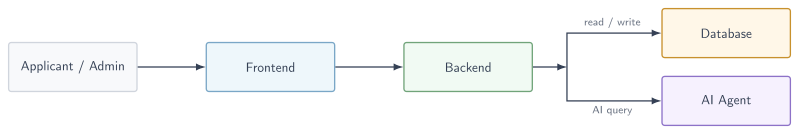

## Agent Pipeline

  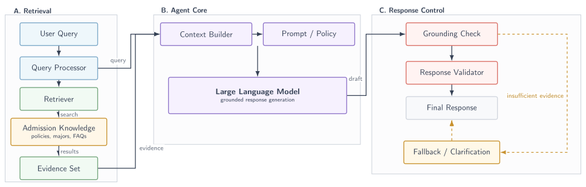

## Database ERD

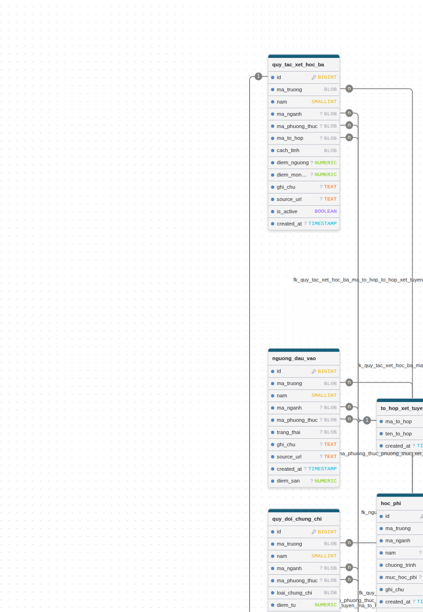

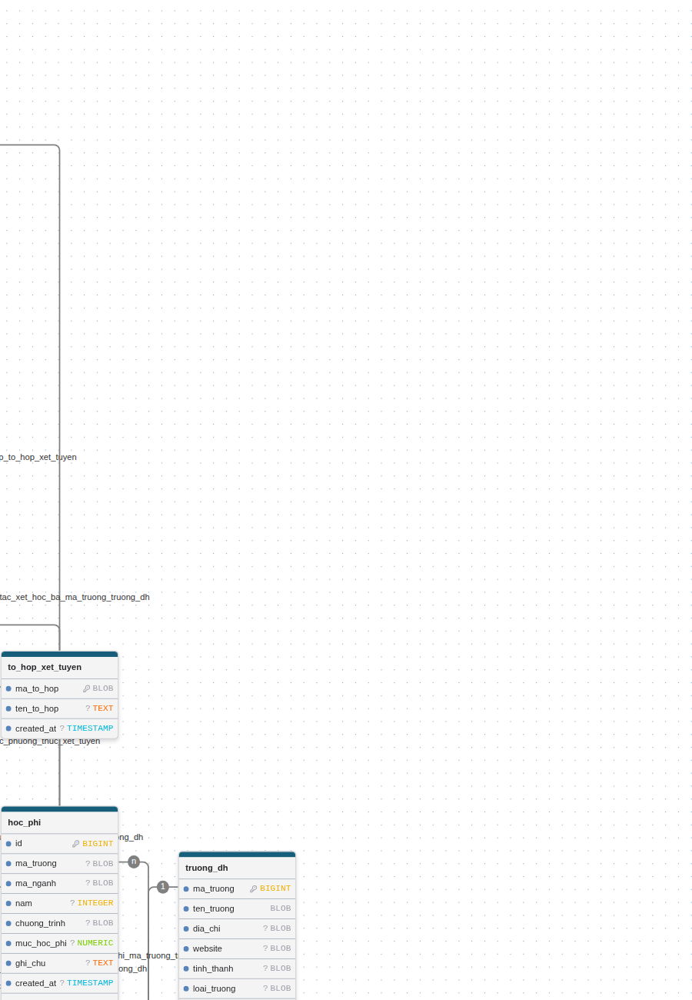

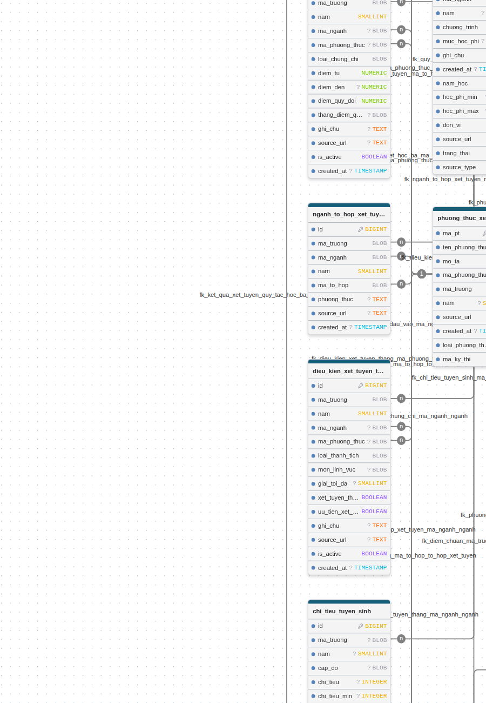

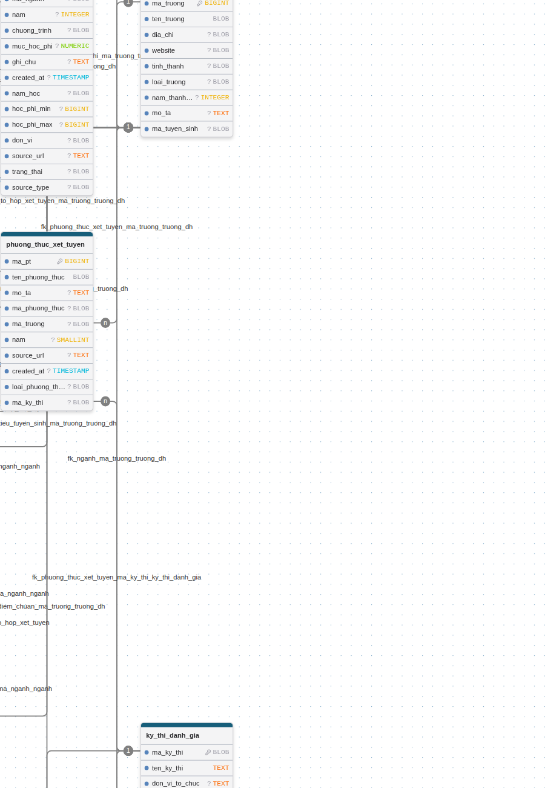

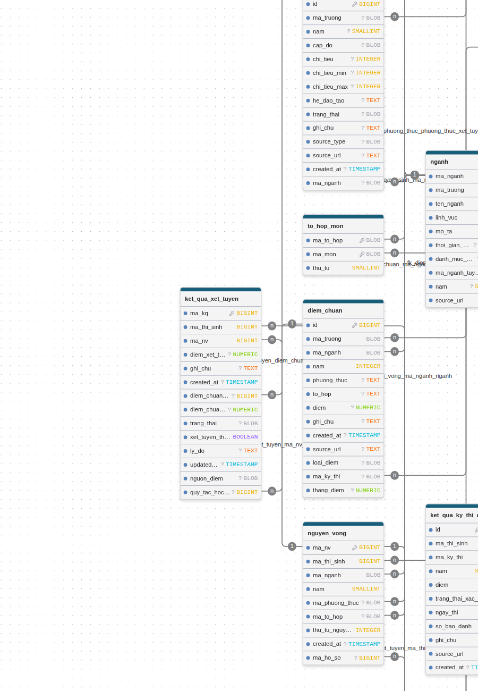

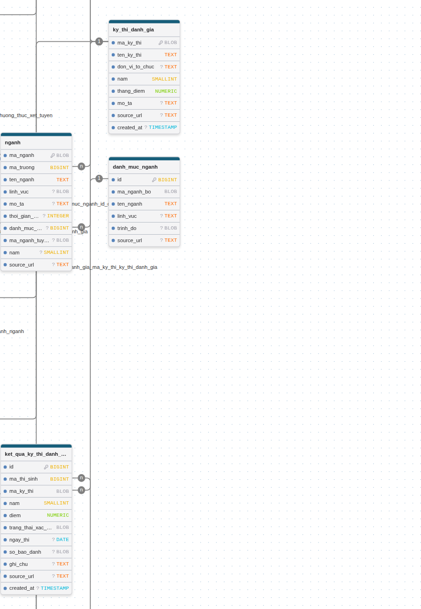

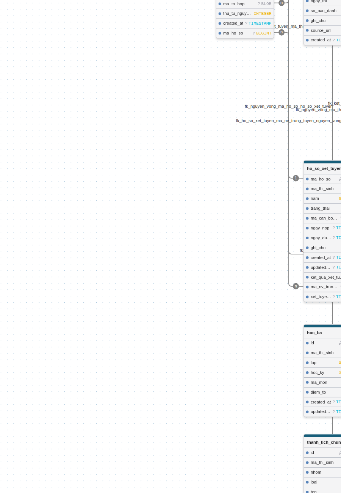

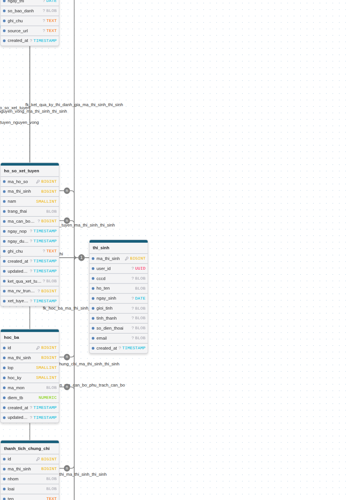

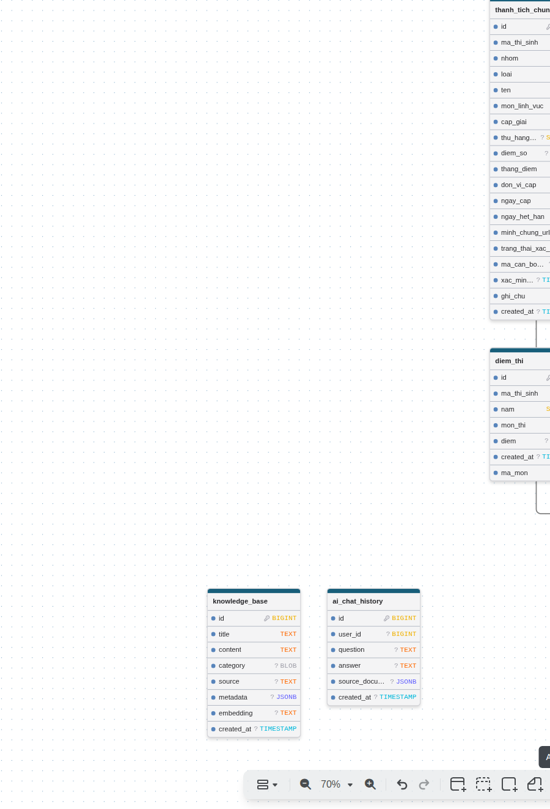

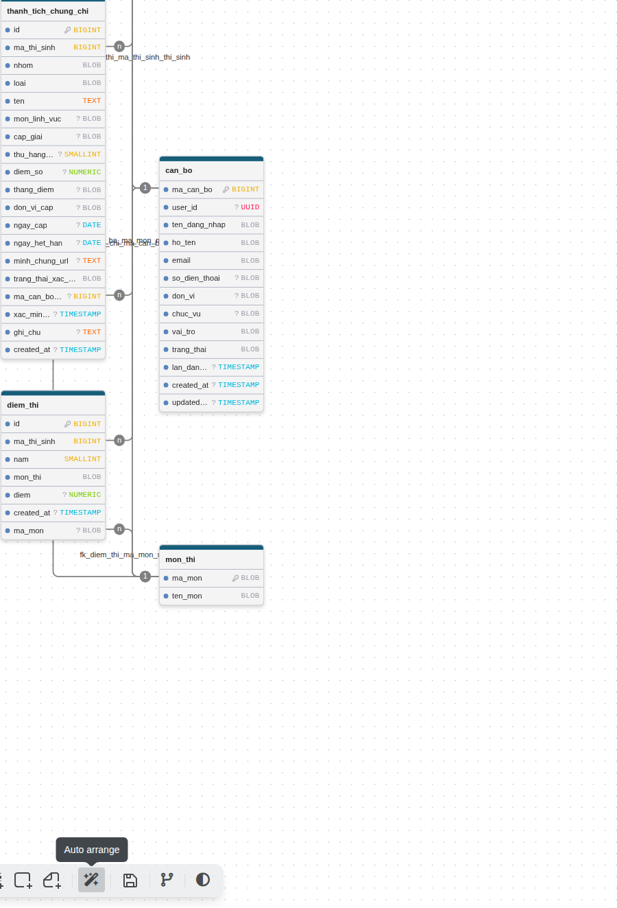

