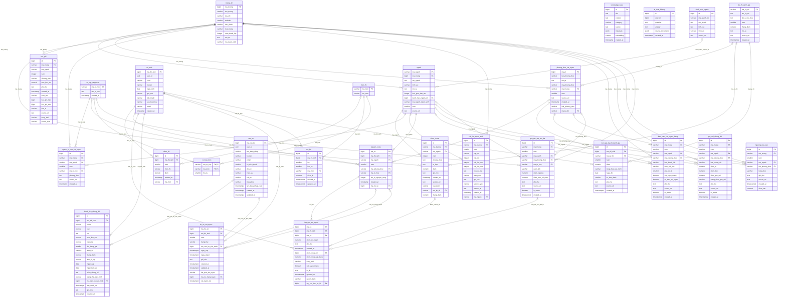

# Database ERD

GitHub-native Mermaid diagram generated from [`schema.sql`](./schema.sql).

> Use browser zoom to inspect the full diagram. GitHub renders Mermaid as SVG.

```mermaid
erDiagram
    truong_dh {
        bigint ma_truong PK
        varchar ten_truong
        varchar dia_chi
        varchar website
        varchar tinh_thanh
        varchar loai_truong
        integer nam_thanh_lap
        text mo_ta
        varchar ma_tuyen_sinh
    }
    nganh {
        varchar ma_nganh PK
        bigint ma_truong FK
        text ten_nganh
        varchar linh_vuc
        text mo_ta
        integer thoi_gian_dao_tao
        bigint danh_muc_nganh_id FK
        varchar ma_nganh_tuyen_sinh
        smallint nam
        text source_url
    }
    phuong_thuc_xet_tuyen {
        bigint ma_pt PK
        varchar ten_phuong_thuc
        text mo_ta
        varchar ma_phuong_thuc
        varchar ma_truong FK
        smallint nam
        text source_url
        timestamp created_at
        varchar loai_phuong_thuc
        varchar ma_ky_thi FK
    }
    diem_chuan {
        bigint id PK
        varchar ma_truong FK
        varchar ma_nganh FK
        integer nam
        text phuong_thuc
        text to_hop
        numeric diem
        text ghi_chu
        timestamp created_at
        text source_url
        varchar loai_diem
        varchar ma_ky_thi FK
        numeric thang_diem
    }
    hoc_phi {
        bigint id PK
        varchar ma_truong FK
        varchar ma_nganh
        integer nam
        varchar chuong_trinh
        numeric muc_hoc_phi
        text ghi_chu
        timestamp created_at
        varchar nam_hoc
        bigint hoc_phi_min
        bigint hoc_phi_max
        varchar don_vi
        text source_url
        varchar trang_thai
        varchar source_type
    }
    knowledge_base {
        bigint id PK
        text title
        text content
        varchar category
        text source
        jsonb metadata
        custom embedding
        timestamp created_at
    }
    ai_chat_history {
        bigint id PK
        bigint user_id
        text question
        text answer
        jsonb source_documents
        timestamp created_at
    }
    danh_muc_nganh {
        bigint id PK
        varchar ma_nganh_bo
        text ten_nganh
        text linh_vuc
        varchar trinh_do
        text source_url
    }
    to_hop_xet_tuyen {
        varchar ma_to_hop PK
        text ten_to_hop
        timestamp created_at
    }
    nganh_to_hop_xet_tuyen {
        bigint id PK
        varchar ma_truong FK
        varchar ma_nganh FK
        smallint nam
        varchar ma_to_hop FK
        text phuong_thuc
        text source_url
        timestamp created_at
    }
    chi_tieu_tuyen_sinh {
        bigint id PK
        varchar ma_truong FK
        smallint nam
        varchar cap_do
        integer chi_tieu
        integer chi_tieu_min
        integer chi_tieu_max
        text he_dao_tao
        varchar trang_thai
        text ghi_chu
        varchar source_type
        text source_url
        timestamp created_at
        varchar ma_nganh FK
    }
    thi_sinh {
        bigint ma_thi_sinh PK
        uuid user_id
        varchar cccd
        varchar ho_ten
        date ngay_sinh
        varchar gioi_tinh
        varchar tinh_thanh
        varchar so_dien_thoai
        varchar email
        timestamp created_at
    }
    diem_thi {
        bigint id PK
        bigint ma_thi_sinh FK
        smallint nam
        varchar mon_thi
        numeric diem
        timestamp created_at
        varchar ma_mon FK
    }
    nguyen_vong {
        bigint ma_nv PK
        bigint ma_thi_sinh FK
        varchar ma_nganh FK
        smallint nam
        varchar ma_phuong_thuc FK
        varchar ma_to_hop FK
        integer thu_tu_nguyen_vong
        timestamp created_at
        bigint ma_ho_so FK
    }
    ket_qua_xet_tuyen {
        bigint ma_kq PK
        bigint ma_thi_sinh FK
        bigint ma_nv FK
        numeric diem_xet_tuyen
        text ghi_chu
        timestamp created_at
        bigint diem_chuan_id FK
        numeric diem_chuan_ap_dung
        varchar trang_thai
        boolean xet_tuyen_thang
        text ly_do
        timestamptz updated_at
        varchar nguon_diem
        bigint quy_tac_hoc_ba_id FK
    }
    can_bo {
        bigint ma_can_bo PK
        uuid user_id
        varchar ten_dang_nhap
        varchar ho_ten
        varchar email
        varchar so_dien_thoai
        varchar don_vi
        varchar chuc_vu
        varchar vai_tro
        varchar trang_thai
        timestamptz lan_dang_nhap_cuoi
        timestamptz created_at
        timestamptz updated_at
    }
    thanh_tich_chung_chi {
        bigint id PK
        bigint ma_thi_sinh FK
        varchar nhom
        varchar loai
        text ten
        varchar mon_linh_vuc
        varchar cap_giai
        smallint thu_hang_giai
        numeric diem_so
        varchar thang_diem
        varchar don_vi_cap
        date ngay_cap
        date ngay_het_han
        text minh_chung_url
        varchar trang_thai_xac_minh
        bigint ma_can_bo_xac_minh FK
        timestamptz xac_minh_luc
        text ghi_chu
        timestamptz created_at
    }
    dieu_kien_xet_tuyen_thang {
        bigint id PK
        varchar ma_truong FK
        smallint nam
        varchar ma_nganh FK
        varchar ma_phuong_thuc FK
        varchar loai_thanh_tich
        varchar mon_linh_vuc
        smallint giai_toi_da
        boolean xet_tuyen_thang
        boolean uu_tien_xet_tuyen
        text ghi_chu
        text source_url
        boolean is_active
        timestamptz created_at
    }
    quy_doi_chung_chi {
        bigint id PK
        varchar ma_truong FK
        smallint nam
        varchar ma_nganh FK
        varchar ma_phuong_thuc FK
        varchar loai_chung_chi
        numeric diem_tu
        numeric diem_den
        numeric diem_quy_doi
        varchar thang_diem_quy_doi
        text ghi_chu
        text source_url
        boolean is_active
        timestamptz created_at
    }
    nguong_dau_vao {
        bigint id PK
        varchar ma_truong FK
        smallint nam
        varchar ma_nganh FK
        varchar ma_phuong_thuc FK
        varchar trang_thai
        text ghi_chu
        text source_url
        timestamptz created_at
        numeric diem_san
    }
    mon_thi {
        varchar ma_mon PK
        varchar ten_mon
    }
    ho_so_xet_tuyen {
        bigint ma_ho_so PK
        bigint ma_thi_sinh FK
        smallint nam
        varchar trang_thai
        bigint ma_can_bo_phu_trach FK
        timestamptz ngay_nop
        timestamptz ngay_duyet
        text ghi_chu
        timestamptz created_at
        timestamptz updated_at
        varchar ket_qua_xet_tuyen
        bigint ma_nv_trung_tuyen FK
        timestamptz xet_tuyen_luc
    }
    hoc_ba {
        bigint id PK
        bigint ma_thi_sinh FK
        smallint lop
        smallint hoc_ky
        varchar ma_mon FK
        numeric diem_tb
        timestamptz created_at
        timestamptz updated_at
    }
    to_hop_mon {
        varchar ma_to_hop PK, FK
        varchar ma_mon PK, FK
        smallint thu_tu
    }
    quy_tac_xet_hoc_ba {
        bigint id PK
        varchar ma_truong FK
        smallint nam
        varchar ma_nganh FK
        varchar ma_phuong_thuc FK
        varchar ma_to_hop FK
        varchar cach_tinh
        numeric diem_nguong
        numeric diem_mon_toi_thieu
        text ghi_chu
        text source_url
        boolean is_active
        timestamptz created_at
    }
    ky_thi_danh_gia {
        varchar ma_ky_thi PK
        text ten_ky_thi
        text don_vi_to_chuc
        smallint nam
        numeric thang_diem
        text mo_ta
        text source_url
        timestamptz created_at
    }
    ket_qua_ky_thi_danh_gia {
        bigint id PK
        bigint ma_thi_sinh FK
        varchar ma_ky_thi FK
        smallint nam
        numeric diem
        varchar trang_thai_xac_minh
        date ngay_thi
        varchar so_bao_danh
        text ghi_chu
        text source_url
        timestamptz created_at
    }

    truong_dh ||--o{ nganh : "ma_truong"
    danh_muc_nganh o|--o{ nganh : "danh_muc_nganh_id"
    truong_dh o|--o{ phuong_thuc_xet_tuyen : "ma_truong"
    ky_thi_danh_gia o|--o{ phuong_thuc_xet_tuyen : "ma_ky_thi"
    truong_dh ||--o{ diem_chuan : "ma_truong"
    nganh ||--o{ diem_chuan : "ma_nganh"
    ky_thi_danh_gia o|--o{ diem_chuan : "ma_ky_thi"
    truong_dh o|--o{ hoc_phi : "ma_truong"
    nganh ||--o{ nganh_to_hop_xet_tuyen : "ma_nganh"
    to_hop_xet_tuyen ||--o{ nganh_to_hop_xet_tuyen : "ma_to_hop"
    truong_dh ||--o{ nganh_to_hop_xet_tuyen : "ma_truong"
    truong_dh o|--o{ chi_tieu_tuyen_sinh : "ma_truong"
    nganh o|--o{ chi_tieu_tuyen_sinh : "ma_nganh"
    mon_thi o|--o{ diem_thi : "ma_mon"
    thi_sinh ||--o{ diem_thi : "ma_thi_sinh"
    thi_sinh ||--o{ nguyen_vong : "ma_thi_sinh"
    nganh ||--o{ nguyen_vong : "ma_nganh"
    to_hop_xet_tuyen o|--o{ nguyen_vong : "ma_to_hop"
    ho_so_xet_tuyen o|--o{ nguyen_vong : "ma_ho_so"
    phuong_thuc_xet_tuyen o|--o{ nguyen_vong : "ma_phuong_thuc"
    quy_tac_xet_hoc_ba o|--o{ ket_qua_xet_tuyen : "quy_tac_hoc_ba_id"
    thi_sinh ||--o{ ket_qua_xet_tuyen : "ma_thi_sinh"
    nguyen_vong ||--o{ ket_qua_xet_tuyen : "ma_nv"
    diem_chuan o|--o{ ket_qua_xet_tuyen : "diem_chuan_id"
    thi_sinh ||--o{ thanh_tich_chung_chi : "ma_thi_sinh"
    can_bo o|--o{ thanh_tich_chung_chi : "ma_can_bo_xac_minh"
    nganh o|--o{ dieu_kien_xet_tuyen_thang : "ma_nganh"
    truong_dh ||--o{ dieu_kien_xet_tuyen_thang : "ma_truong"
    phuong_thuc_xet_tuyen o|--o{ dieu_kien_xet_tuyen_thang : "ma_phuong_thuc"
    nganh o|--o{ quy_doi_chung_chi : "ma_nganh"
    truong_dh ||--o{ quy_doi_chung_chi : "ma_truong"
    phuong_thuc_xet_tuyen o|--o{ quy_doi_chung_chi : "ma_phuong_thuc"
    truong_dh ||--o{ nguong_dau_vao : "ma_truong"
    nganh o|--o{ nguong_dau_vao : "ma_nganh"
    phuong_thuc_xet_tuyen o|--o{ nguong_dau_vao : "ma_phuong_thuc"
    thi_sinh ||--o{ ho_so_xet_tuyen : "ma_thi_sinh"
    can_bo o|--o{ ho_so_xet_tuyen : "ma_can_bo_phu_trach"
    nguyen_vong o|--o{ ho_so_xet_tuyen : "ma_nv_trung_tuyen"
    thi_sinh ||--o{ hoc_ba : "ma_thi_sinh"
    mon_thi ||--o{ hoc_ba : "ma_mon"
    to_hop_xet_tuyen ||--o{ to_hop_mon : "ma_to_hop"
    mon_thi ||--o{ to_hop_mon : "ma_mon"
    phuong_thuc_xet_tuyen o|--o{ quy_tac_xet_hoc_ba : "ma_phuong_thuc"
    to_hop_xet_tuyen o|--o{ quy_tac_xet_hoc_ba : "ma_to_hop"
    truong_dh ||--o{ quy_tac_xet_hoc_ba : "ma_truong"
    nganh o|--o{ quy_tac_xet_hoc_ba : "ma_nganh"
    thi_sinh ||--o{ ket_qua_ky_thi_danh_gia : "ma_thi_sinh"
    ky_thi_danh_gia ||--o{ ket_qua_ky_thi_danh_gia : "ma_ky_thi"
```
